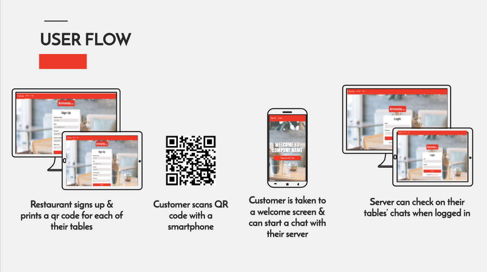
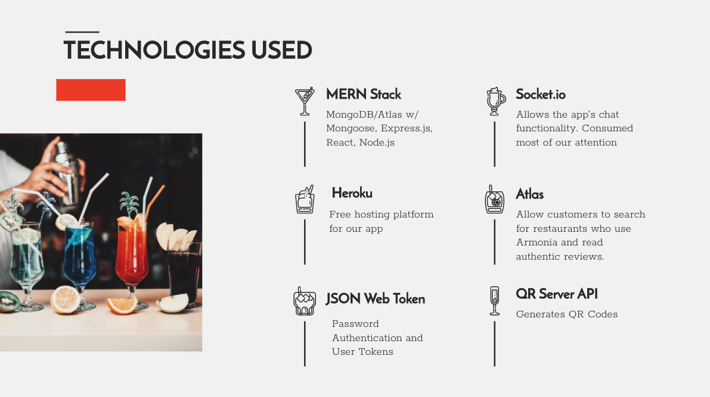
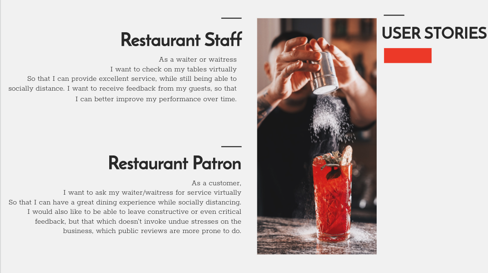
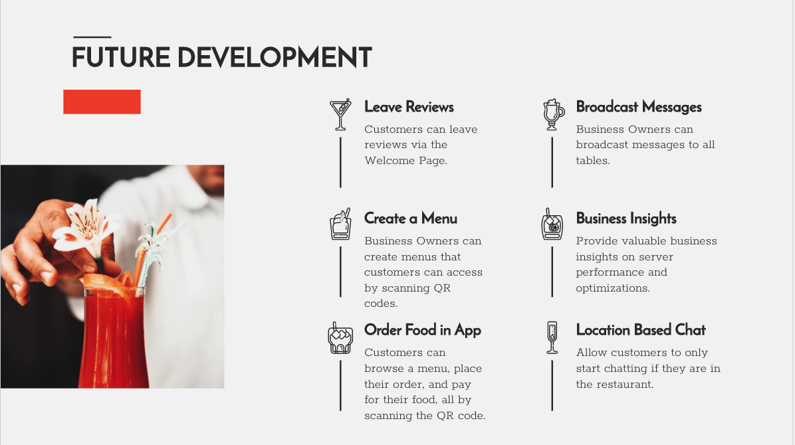

## App Demo

<iframe width="736" height="412" src="https://www.youtube.com/embed/videoseries?list=PLKNZBvvuVbCo_Q0Ww7T7EWyQuFqVHdTDM&autoplay=1&loop=1" frameborder="0" allow="accelerometer; autoplay; clipboard-write; encrypted-media; gyroscope; picture-in-picture" allowfullscreen></iframe>

## About App

2020 has shifted how the Food & Beverage service industry conducts business. From masked staff & guests, to lower seating capacities & privacy bubbles. Ever changing health mandates continue to create new challenges for how service staff connect with their guests. 

Armonia has introduced a new chat and service app, which will help limit the amount of face to face interactions for staff, while still providing guests with excellent and safe service.

The deployed project can be viewed [here](https://cobramon.herokuapp.com/signup). The project is responsive and can be viewed on mobile, tablet or desktop.

---

## Creators: 

- [Garrett Trask](https://goodbyetonto.github.io/Portfolio)
- [Kelly Gowing](https://kelly70ve.github.io/)
- [Nick Kim](https://github.com/nbkim89)
- [Rocky Salerno](https://rrsalerno21.github.io/)

