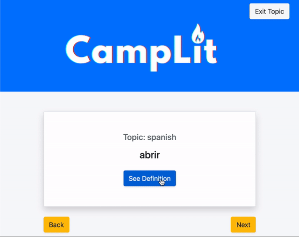

## App Preview

## About App

Having used many other applications for studying such as quizlet, our group decided to come up with a way that we can streamline studying. With the virtual flashcards users are able to customize the information to fit their studying needs.

This project has been completed with no known bugs and can be viewed <a href="https://camplit.herokuapp.com/" target="_blank" rel="noreferrer">here</a>. The project is responsive and can be viewed on mobile, tablet or desktop.

## Technologies Used

- HTML5
- CSS3
- Bootstrap
- Handlebars
- Javascript
- Sequelize
- Node.js
- Express

## User Story

- AS A student, I want to be able to create flashcards and study them
- I WANT to be able to be able to create different topics to study from
- SO THAT I can organize my flashcards by the different subjects I study

## Contributors

- <a href="https://kelly70ve.github.io/" target="_blank" rel="noreferrer">Kelly Gowing</a>
- <a href="https://github.com/nbkim89" target="_blank" rel="noreferrer">Nick Kim</a>
