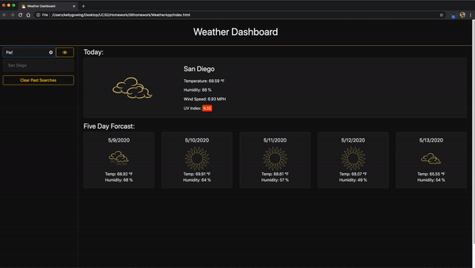

## App Preview

## About App

This application is a weather dashboard that will run in the browser and feature dynamically updated HTML and CSS using the <a href="https://openweathermap.org/api" target="_blank" rel="noreferrer">OpenWeather API</a> to retrieve weather data for cities.

This project has been completed with no known bugs and can be viewed <a href="https://kelly70ve.github.io/WeatherApp/" target="_blank" rel="noreferrer">here</a>. The project is responsive and can be viewed on mobile, tablet or desktop.

\*\* This is my first attempt at a dark themed app!

## Questions?

- Please email me if you have any questions at kelly.a.gowing@gmail.com
- OR visit my <a href="https://github.com/kelly70ve" target="_blank" rel="noreferrer">GitHub</a>
