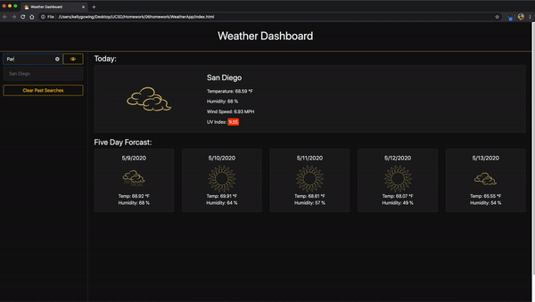

## App Preview 





## About App

This application is a weather dashboard that will run in the browser and feature dynamically updated HTML and CSS using the <a href="https://openweathermap.org/api" target="_blank">OpenWeather API</a> to retrieve weather data for cities. 

This project has been completed with no known bugs and can be viewed <a href="https://kelly70ve.github.io/WeatherApp/" target="_blank">here</a>. The project is responsive and can be viewed on mobile, tablet or desktop.

** This is my first attempt at a dark themed app!

### User Story
```
AS A user, I want to be able to write and save my tasks

I WANT to be able to delete tasks I've saved before

SO THAT I can organize my thoughts and keep track of tasks I need to complete 
```

## Future Development 
Currently, this app is not mobile ready and is best viewed on desktop.

## Questions? 
* Please email me if you have any questions at kelly.a.gowing@gmail.com
* OR visit my <a href="https://github.com/kelly70ve" target="_blank">GitHub</a> 