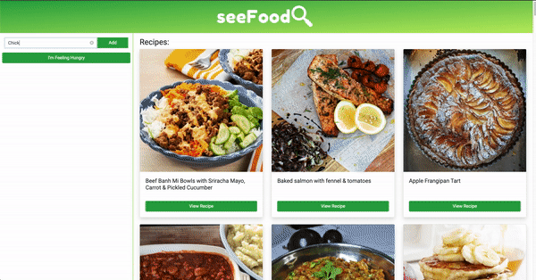

## App Preview 

## About App

Who knew that the hardest part about becoming an adult is coming up with dinner every night for the rest of your life?

seeFood is an app that can help you answer the dreaded question, “What do you want to eat?”

Simply enter the ingredients you already have in your kitchen, and seeFood will provide you with recipes using your ingredients.

This project has been completed with no known bugs and can be viewed <a href="https://goodbyetonto.github.io/first-project/" target="_blank">here</a>. The project is responsive and can be viewed on mobile, tablet or desktop.

## Technologies Used 

This application features dynamically updated HTML and CSS through jQuery/JavaScript using the <a href="https://www.themealdb.com/" target="_blank">The Meal DB API</a> to retrieve recipe data.

## User Story

- As a person who is not very creative in the kitchen
- I want to be able to find recipes based on what I have in my fridge & pantry
- So that I can cook better to impress my friends and loved ones

## Contributors

- <a href="https://goodbyetonto.github.io/Portfolio" target="_blank">Garrett Trask</a>
- <a href="https://kelly70ve.github.io/" target="_blank">Kelly Gowing</a>
- <a href="https://rrsalerno21.github.io/" target="_blank">Rocky Salerno</a>

